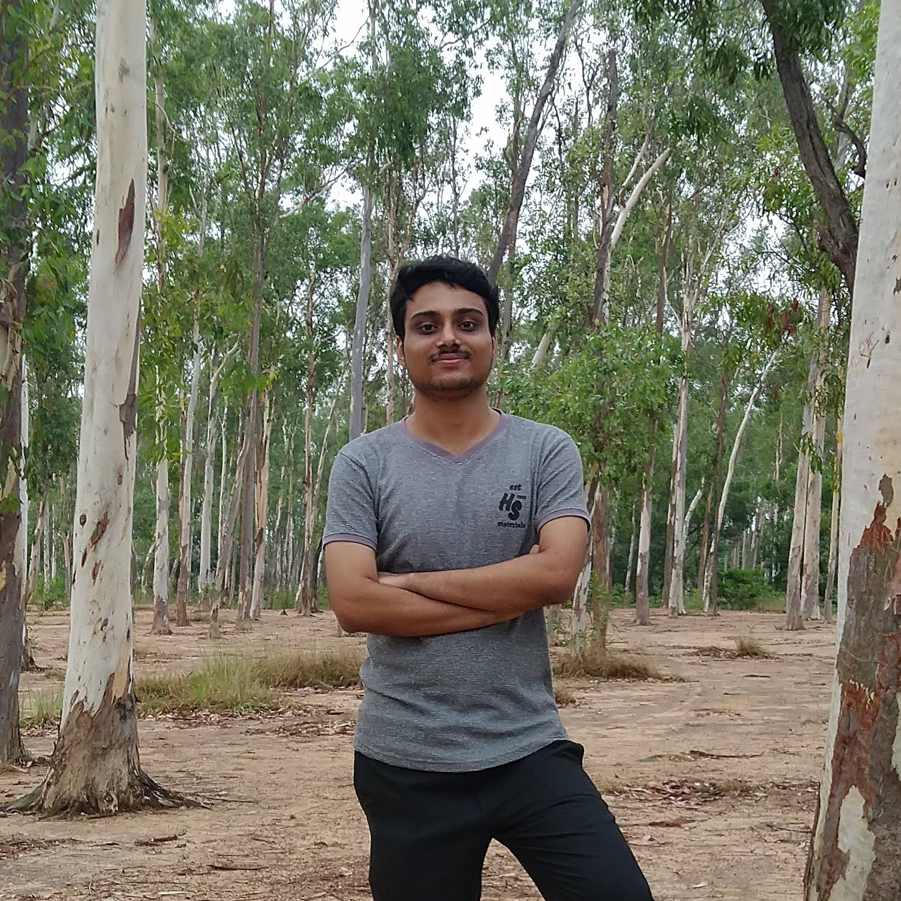

Hi, I am a Biostatistics and Demography student at the International Institute for Population Sciences (IIPS), Mumbai. I love to deal with applied Statistics. While not in class, you'll mostly find me reading novels and bingeing *The Crown* (this changes) over and over.

I shall use this blog as my personal space to share what I have on my mind. Though I started this blog to document statistical techniques, I have decided not to confine myself within its barriers. I'll write about places I visit (COVID-19!!! :upside_down_face:), food I had, books I read and much more.

Feel free to have a look at the [GitHub repo](https://github.com/r-saikat/blog) used to maintain his blog and submit PRs.

Want to send me a message?

<form name="contact" method="POST" data-netlify-recaptcha="true" data-netlify="true">
  

    <label>Name: <input type="text" name="name" /></label>
  

  

    <label>Email: <input type="text" name="email" /></label>
  

  

    <label>Message: <textarea name="message"  rows="10" cols="100"></textarea></label>
  

  

  

    <button type="submit">Send</button>
  

</form>

