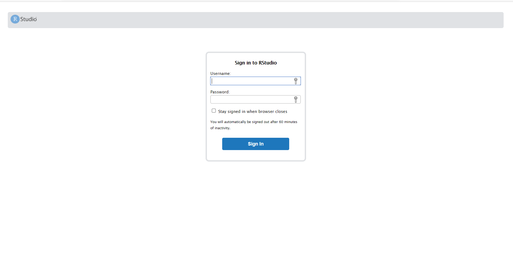

RStudio is an Integrated Development Environment for R. It has made life easier for thousands of R programmers. In this era of IoT and low power computing, [ARM](https://www.arm.com/) chips are becoming increasingly popular, not only in mobile devices but also in high-end laptops. The [Raspberry Pi project](https://www.raspberrypi.org/) has popularised always-on, low-power computing. Many cloud providers, like [AWS](https://aws.amazon.com/), [Oracle cloud](https://www.oracle.com/in/cloud/), etc., have recognised the tremendous possibilities with ARM chips and offer powerful ARM-based machines.

R has recently been ported for the ARM architecture, thanks to Apple. However, RStudio is yet to publish an ARM binary and needs to be built from source. This, is itself is a tough task, given its multiple dependencies, especially for people having a minor in Computer Science like me. It is easier to use a docker container with preconfigured Rstudio files. The [rocker](https://hub.docker.com/r/rocker/rstudio) project is a great one and [corradolanera](https://hub.docker.com/r/corradolanera/rstudio-rpi4b) has ported it for the ARM architecture. Visit [rocker](https://hub.docker.com/r/rocker/rstudio) for more documentation.

I use Oracles Cloud's lifetime free tier to host RStudio and train my models on a 4 core 24 GB RAM machine. With most packages, R can utilise only one core but the high memory definitely helps while dealing with large datasets. Let's jump into the process of setting things up on an Ubuntu 20.04 server.

### Installing the server

At first, launch a VM and open the firewall ports 80 and 443 to allow all HTTP and HTTPS traffics. Run `sudo apt update` and `sudo apt upgrade`.

It's easier to handle the firewall at only one place, which is sitting in front of our VM instead of having a second firewall on our VM. Run `sudo iptables -F` and `sudo netfilter-persistent save` to flush all `iptables` rules and make them persistent on reboot. This is important if you are on Oracle cloud as they block every port by default. *This should be avoided if you have some other `iptables` rule for another purpose. In that case, I expect you already have the appropriate expertise to deal with it.*


Next, install docker and pull the docker image to your machine:

```
sudo apt install docker
sudo apt install docker.io
sudo docker pull corradolanera/rstudio-rpi4b:v1.4.1106
```
Now, we need to launch the docker container. The following code: 

1. forwards the ports 3838 and 8787 to the local machine for the shiny and the RStudio servers respectively.
2. launches the RStudio server with the username 'username' and password 'y0urpa$$w0rdhere'. Replace these terms in the command to your preferred values. *Choose a strong password since the service will be exposed to the public internet by default.*
3. the container won't be stopped unless explicitly commanded to. This should help us to restart the conatiner even after a system reboot.

```
sudo docker run -d -p 3838:3838 -p 8787:8787 -e ADD=shiny -e USER=username -e PASSWORD=y0urpa$$w0rdhere --restart unless-stopped corradolanera/rstudio-rpi4b:v1.4.1106
```
Note down the `container ID` by running `sudo docker ps -a`. 

For adding more users, run `sudo docker exec -ti <CONTAINER_ID> bash` to access the bash terminal of the container. Now, you may add new users to RStudio server using `sudo adduser username`. Avoid giving sudo priviledges to the users for better security.

### Publishing the RStudio Server to the Web

The container has been launced, but we won't be able to access the RStudio server yet if we are accessing the server remotely. We may expose the port 8787 to the web and use RStudio server  directly. However, this is not be a secure setup, especially if we are using a cloud service for our VM. Also, it's cumbersome to write `IP:8787` each time while accessing RStudio. We'll set up a nginx reverse proxy to forward traffic on `localhost:8787` to port 80 on the web. Later, we'll create an SSL/ TLS certificate to secure the connection. For now, execute,

```
sudo apt install nginx #install nginx
```

Edit `/etc/nginx/nginx.conf` using your favourite text editor. To use `nano`, run `sudo nano /etc/nginx/nginx.conf`. Add this to the `http{ }` section:

```
map $http_upgrade $connection_upgrade {
            default upgrade;
            ''      close;
        }
```

The file should look something like this after the edit:

```
http {
        # Basic Settings
        # ...

        map $http_upgrade $connection_upgrade {
            default upgrade;
            ''      close;
        }
		
		#Some initial text already here. Let it be as it is.
}
### Some more text here.
```

Next, add the follwoing section to `/etc/nginx/conf.d/rstudio.conf` using `sudo nano /etc/nginx/conf.d/rstudio.conf`:

```
server {
        listen 80;
        listen [::]:80;

        server_name example.com; 
        #######IMPORTANT: Replace example.com with your ip/ domain name.

        location / {
             proxy_pass http://localhost:8787/;
             proxy_redirect http://localhost:8787/ $scheme://$host/;
             proxy_http_version 1.1;
             proxy_set_header Upgrade $http_upgrade;
             proxy_set_header Connection $connection_upgrade;
             proxy_read_timeout 20d;
        }
}
```

Remember to replace `example.com` with your domain or a subdomain. It's fairly cheap to buy domains, if you already don't have one. You may use namecheap to buy domains, or [freenom](https://www.freenom.com/en/index.html?lang=en) for a free domain. Point the domain to the IP of the VM on the domain registrar/ nameserver page. Alternatively, you may use the public IP of the VM to access instead of a domain name. This is strongly discouraged as it may leave the connection between the server and your browser insecure. If the server is on a local network, such as your home, you may use it with the IP. Execute `sudo nginx -t` to verify the configuration details.  The output should be similar to:

```
nginx: the configuration file /etc/nginx/nginx.conf syntax is ok
nginx: configuration file /etc/nginx/nginx.conf test is successful
```

Finally, we need to restart nginx using `sudo systemctl restart nginx` for the settings change to take effect. Visit the domain/ IP and the Rstudio welcome page should be greeting you.



Use the username and password set earlier to access RStudio. 

### Obtaining an SSL certificate


*This step is optional but strongly recommended for better security. This is not necessary if you are on a local network.* The connection between the server and our browser is unsecure and we need to encrypt the connection. Without an SSL certificate, anyone can monitor the data transfer between the browser and the server, including the passwords.

We shall use a free certificate from Let's Encrypt for this purpose.

```
sudo apt install certbot python3-certbot-nginx
sudo certbot --nginx
```

Follow the interactive instructions on your terminal to get the certificate. Choose the option to redirect all HTTP traffic to HTTPS so that you are always on a secure connection.

It's all set. Enjoy a portable version of RStudio on a cloud.
